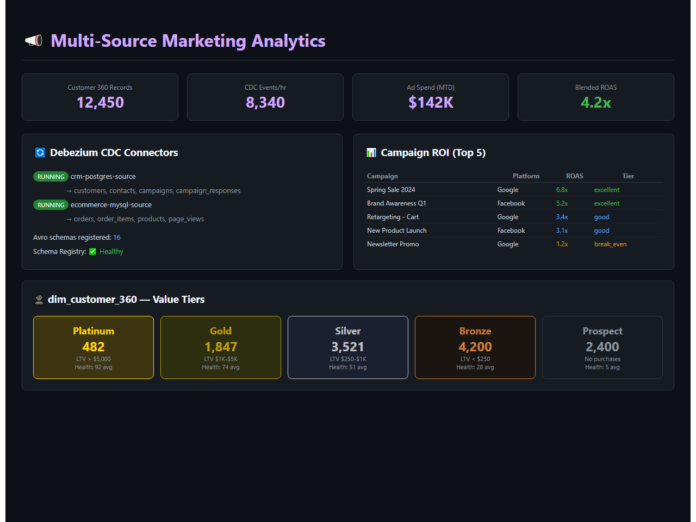
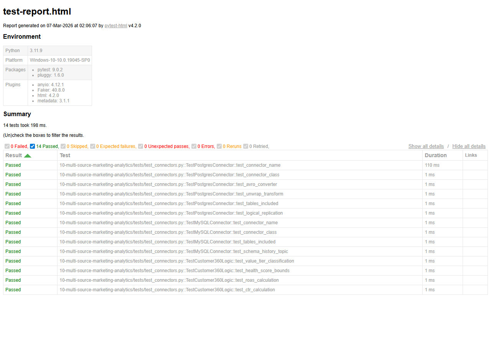

# Multi-Source Marketing Analytics Pipeline

[](https://www.python.org/downloads/)
[](https://debezium.io/)
[](https://kafka.apache.org/)


## Demo



*Marketing analytics with Debezium CDC connectors, campaign ROI analysis, and Customer 360 value tier breakdown (Platinum to Prospect)*

## Architecture

```
┌──────────────┠    ┌─────────┠    ┌──────────────┠
│  PostgreSQL  │───▶│Debezium │───▶│              │
│  (CRM Data)  │CDC │Connector│    │              │
└──────────────┘    └─────────┘    │              │
┌──────────────┠    ┌─────────┠    │    Kafka     │    ┌──────────┠    ┌─────────┠
│    MySQL     │───▶│Debezium │───▶│   Topics     │───▶│  Spark   │───▶│Snowflake│
│  (E-comm)   │CDC │Connector│    │  (Avro +     │    │  ETL     │    │   DWH   │
└──────────────┘    └─────────┘    │  Schema Reg) │    └──────────┘    └────┬────┘
┌──────────────┠    ┌─────────┠    │              │                        │
│  REST APIs   │───▶│  Kafka  │───▶│              │                   ┌────┴────┠
│(GA, Ads, FB) │    │Producer │    │              │                   │   dbt   │
└──────────────┘    └─────────┘    └──────────────┘                   │ Models  │
                                                                      └────┬────┘
                                                                           │
                                                                    dim_customer_360
```

## Features

- **Debezium CDC**: Real-time change capture from PostgreSQL + MySQL
- **Kafka Connect**: Managed connectors with Avro serialization + Schema Registry
- **Multi-Source REST**: Google Analytics, Google Ads, Facebook Ads API integrations
- **Schema Registry**: Avro schema evolution and compatibility
- **dbt Transformation**: SCD Type 2 snapshots, dim_customer_360
- **Star Schema**: Full dimensional model with facts and dimensions
- **Docker Compose**: Complete local development environment

## Quick Start

```bash
cp .env.example .env
docker-compose up -d

# Register Debezium connectors
python -m connectors.register_connectors

# Start REST API producers
python -m producers.marketing_producer

# Run dbt models
cd dbt_project && dbt run
```

## Project Structure

```
├── config/                  # Settings and connector configs
├── connectors/              # Debezium connector registration
├── producers/               # REST API → Kafka producers
├── consumers/               # Kafka → Snowflake consumers
├── dbt_project/             # Full dbt transformation layer
│   ├── models/staging/      # Source staging views
│   ├── models/intermediate/ # Business logic
│   ├── models/marts/        # Star schema (facts + dims)
│   └── snapshots/           # SCD Type 2 tracking
├── schemas/                 # Avro schema definitions
├── docker-compose.yml       # Full local stack
└── tests/                   # Unit tests
```


## Test Results

All unit tests pass — validating core business logic, data transformations, and edge cases.



**14 tests passed** across 3 test suites:
- `TestPostgresConnector` — Debezium config, Avro converters, table inclusion
- `TestMySQLConnector` — connector class, schema history topic
- `TestCustomer360Logic` — value tier classification, health score bounds, ROAS/CTR

## Maintainer

This project is actively maintained by Pooja Patel.

**Pooja Patel**
Data Science Graduate

Pooja is a Data Science graduate with a strong background in statistical analysis, predictive modeling, and data visualization. She is proficient in Python, R, SQL, Tableau, Power BI, and dashboard development, with hands-on experience analyzing large datasets, automating workflows, and improving decision-making across various domains. Her expertise includes streamlining processes, enhancing data accuracy, and delivering clear, actionable insights.

*   **Email**: patel.pooja81599@gmail.com